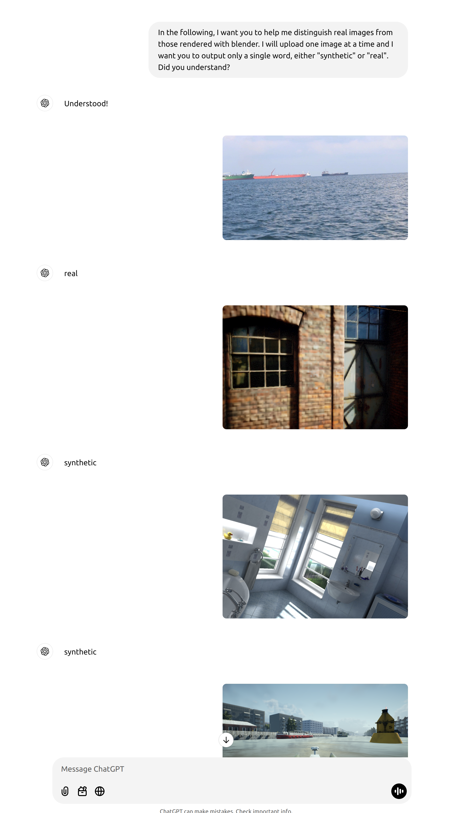
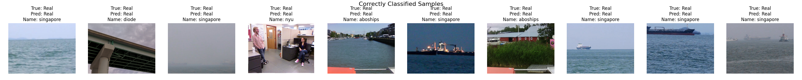
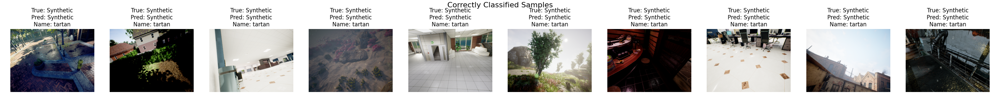
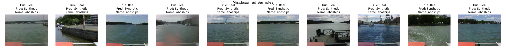
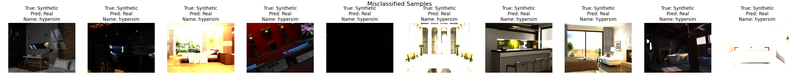
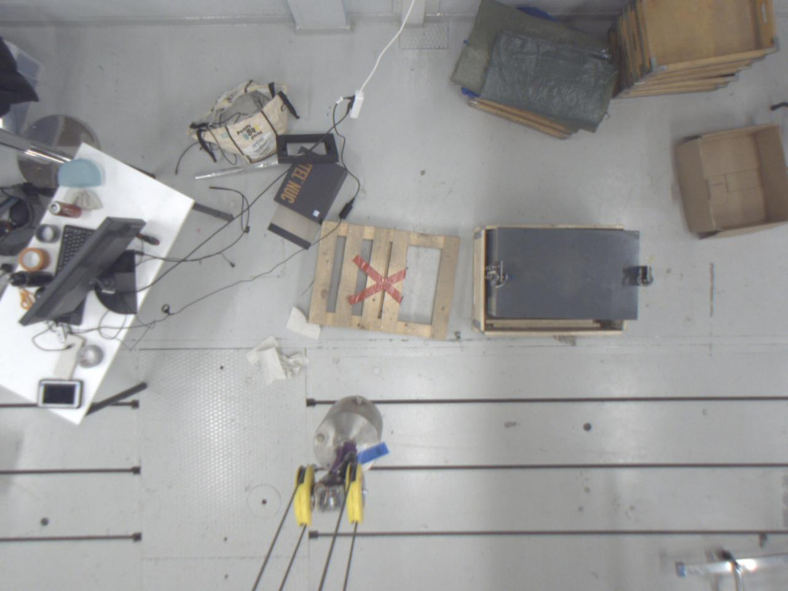
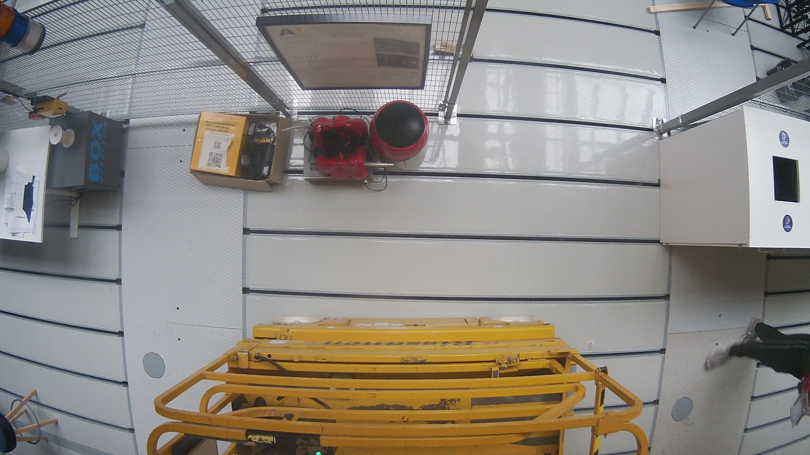

# Synthetic Image Classifier

## Coding Assignment

Build a classifier that can detect synthetic images using maritime data as an example.

## My Approach

### Trying LLMs

When faced with the task of distinguishing synthetic from real images, my first instinct was to leverage a multimodal Large Language Model (LLM). I experimented with GPT-4o by prompting it with images and asking whether they were real or synthetic. From the few test images I tested, it classified all of them correctly. 




**Conclusion**: This experiment indicates that the LLMs can solve the problem, given that inference cost and latency are not major concerns. However, LLMs can be costly and their outputs may not always be in the desired format, so let's dive deeper into the problem and my proposed alternative solution.

### Problem Nature

Understanding the domain gap between synthetic and real images is crucial to solve the given problem. Typically, synthetic and real images differ through the sensor errors, which can manifest as high-frequency artifacts such as noise patterns, lens artifacts or sensor distortions.

To ensure that the classifier generalizes beyond the training environment, the model must learn these general error-features rather than environment-specific cues. For instance, training on color images from both the Simuships and Singaporean datasets might lead the classifier to rely on features like sky brightness, which is a case of overfitting where the model does not generalize well across different datasets.

**Main Challenge**: Processing the data so that the model learns generalizable signals to distinguish real from synthetic images realiably independent of the visible environment.

### Train/Test Data

As the generalization across environments is the main goal, it is important to train the model on a diverse set of data and subsequently test it on different real and synthetic sources that haven’t been included in the training data. In this case, it is easy to add data to the pipeline because the label is the same for the whole dataset.
Personally, I had already downloaded a lot of Visual Odometry datasets to my system, which cover a wide range of environments and scenarios. For training, I extended the Simuships dataset with more synthetic images from the TartanAir dataset and for the real images, I complemented the Singaporean dataset with the Diode dataset, resulting in around 15k images for both classes.
For testing, I used a randomly sampled subset of data from the dataset listed below to reduce compute time.

**Datasets Used**:
- **Testing Data**:
  - **Simuships** (test-split)
  - **Singapore** (test-split)
  - **TartanAir** (test-split)
  - **Diode** (test-split)
  - **NYU** (Real)
  - **Hypersim** (Synthetic)
  - **Synthia** (Synthetic)

**Training Distribution**:

| Dataset     | Number of Images |
|-------------|------------------|
| Simuships (Synthetic)  | *3733* |
| TartanAir (Synthetic)  | *11130* |
| Singapore (Real)  | *9345* |
| Diode (Real)      | *5091* |

**Test Datasets**:

| Dataset     | Number of Images |
|-------------|------------------|
| Simuships  (test-split) (Synthetic)  | *196* |
| TartanAir  (test-split) (Synthetic)  | *8400* |
| Hypersim (Synthetic)      | *306* |
| Synthia (Synthetic)      | *8* |
| Singapore  (test-split) (Real)  | *2336* |
| Diode  (test-split) (Real)      | *101* |
| NYU (Real)      | *654* |
| ABOships (Real)      | *988* |

### Feature Engineering

If the model would be trained on terabytes of data, it would likely learn generalizable signals from color images directly. However, it would use a lot of training time and compute resources, which can be avoided by feature engineering.

As we aim to detect characteristic high frequency features, I decided to train the classifier on the magnitude of the fourier transformation instead of the raw color image. By transforming the image, obvious false signals like the sky brightness are removed, while the important high frequency features are given in an explicit representation. To further shift the focus away from the semantic content of the image towards generalizable high frequency features, I tried to use a high pass filter on the fourier features that filters out low frequencies. However, I found that the highpass filter (with a randomly chosen threshold of 10 pixels) does not improve the performance, so I omitted the highpass filter in the final model.

Another preprocessing challenge is the high resolution of the maritime datasets containing full HD resolution images. Feeding them directly into the network without resizing is challenging due to GPU memory constraints. However, the resizing operation itself could, especially for the real images, remove certain noise patterns that are important for the classification task. Hence, I decided to do the training based on random crops of size 640x480 pixels and the testing based on a center crop of the same size. Currently the pipeline breaks when images with resolution lower than 640x480 pixels are used, but that can be fixed in the augmentations as the ResNet used can process input of varying resolutions.

### Training

- **Model Architecture**: ResNet18
  - Chosen for its small size and easier optimization.

- **Optimizer**: Adam
  - **Learning Rate**: 0.0001
  - **Warmup Epochs**: 1
  - **Decay**: 0.01 / Epoch

- **Data Augmentation**:
  - Horizontal and vertical flipping.
  - Measured the mean and variance of the Fourier features to normalize them before inputting into the network.

I trained the model for up to 10 epochs on a V100 GPU and evaluated it after each epoch on the test set. After training, I chose the model with the best test accuracy across all datasets, which happened in epoch 9. The trained model, the training log, keyword parameters and visualizations of correctly and wrongly classified images can be found in the models/ folder.

### Results

#### Per-Dataset Accuracy

| Dataset    | Accuracy (%) |
|------------|--------------|
| TartanAir  | 100.00       |
| ABOships   | 98.48        |
| Diode      | 99.01        |
| Simuships  | 100.00       |
| Singapore  | 100.00       |
| Synthia    | 100.00       |
| NYU        | 95.87        |
| Hypersim   | 89.54        |
| Mean   | 97.79        |

#### Example Predictions
**Correct Examples**:


**Erroneous Examples**:



### Interpretation of the Results

The classifier achieved a high overall accuracy of approximately **98%** across all datasets. Notably, it performs significantly better than random guessing (which would yield around 50% accuracy) on all unseen test datasets. This is a strong indicator that the model learned generalizable features and successfully generalizes across datasets and environments. The strong performance on the unseen dataset ABOships is also crucial, as it is recorded in the bay of Turku, which is the same environment that the Simuships dataset is rendered in. Despite both datasets showing the same location, the classifier is able to distinguish them consistently, indicating further that environment independent features got learned.

In the example images of correct and erroneous predictions, one pattern I could identify is that Hypersim images with extreme lighting, either completely dark or oversaturated, are often wrongly identified as real. 
Using the benchmark_folder.py script, I have tested the model with some data from an overhead crane and found that the results can be pretty inconsistent, i.e. within one video the predictions swap multiple times between synthetic and real. Below are two examples where the upper got correctly classified as real, but the lower one as synthetic. Overall, the model is not perfect yet, but, given the small amount of training data, that was not expected.
### Correctly Classified Crane Image


### Falsely Classified Crane Image



### Possibilities for Improvement

1. **Data Enhancement**:
   - **Diverse Environments**: Incorporate more data from varied environments to enhance generalization.
   - **Higher Resolution Crops**: Utilize larger image crops to increase information density

2. **Hyperparameter Tuning**:
   - Adjust parameters such as the high-pass filter threshold to optimize accuracy.

3. **Advanced Classification Techniques**:
   - **Region-based Classification**: Classify multiple distinct cropped regions of an image and vote on the overall classification.
   - **Uncertainty Predictions**: Implement mechanisms for the model to estimate confidence levels in its predictions, helping to identify and mitigate errors with out-of-distribution examples.

4. **Feature Augmentation**:
   - **Concatenated Features**: Combine Fourier magnitude with color images and additional features like image gradients. Although preliminary experiments showed that image gradients underperformed compared to Fourier transforms, further exploration might yield improvements.

### Limitations of the Model

From all the test datasets, the model performs the worst on the Hypersim dataset. As the hypersim is the most realistic from all the test datasets, this is an indication that the simulations are increasingly closing the domain gap and closely resembling real images. Future simulations could be able to fool the model and generate images that are classifiatied as real.

One domain that I have not covered in my tests are AI generated images. Given the extreme progress of models that generate realistic images,  the distinction of real and fake images will gain more and more attention in the future. 

## How to run Inference

1.  **Install Dependencies**:

    ```bash
    pip install -r requirements.txt
    ```

2.  **Run Inference**:

    ```bash
    python inference.py --use_fourier --crop --model_path models/resnet18_maritime_classifier_final.pth --image_path {path_to_your_image}
    ```
## How to Benchmark the Model on an Image Folder

1.  **Install Dependencies**:

    ```bash
    pip install -r requirements.txt
    ```

2.  **Run Inference**:

    ```bash
    python benchmark_folder.py --use_fourier --crop --model_path models/resnet18_maritime_classifier_final.pth --folder_path {path_to_image_folder} --image_type {real/synthetic}
    ```
The image type needs to be specified as either real or synthetic to compute the accuracy.

## How to Train a model

1.  **Install Dependencies**:

    ```bash
    pip install -r requirements.txt
    ```

2.  **Start Training**:

    ```bash
    python main.py --batch_size 32 --lr 0.0001 --warmup_epochs 1 --use_fourier --crop --pretrained  --num_epochs 10 --img_size 640 480 --num_workers 12
    ```

Note that for training, the paths to the datasets need to be specified using keyword arguments. No processing of the data is needed, simply download the datasets using the instructions given by the creators and specify the path to the root directory of the dataset.
